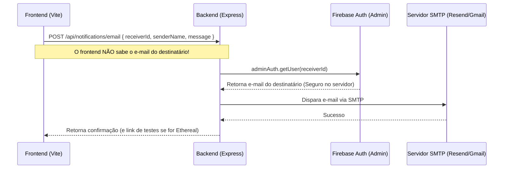

# Guia Prático: Como Configurar e Usar Envio de E-mails (SMTP)

Olá! Este guia foi feito especialmente para você (estudante e desenvolvedor) entender como funciona o envio de e-mails em sistemas web e como configurar isso no futuro se precisar fazer do zero.

---

## 1. Como funciona o Envio de E-mails por Trás dos Panos?

Quando você está no chat e clica em **"Chamar no E-mail"**, a mágica acontece em 3 etapas para respeitar a **LGPD (Lei Geral de Proteção de Dados)**:



1. **Frontend**: Solicita ao backend a notificação enviando apenas o ID do usuário de destino (`receiverId`). O frontend nunca tem acesso ao endereço de e-mail real do outro usuário.
2. **Backend (Express)**: Como ele roda em um ambiente seguro, ele consulta o e-mail cadastrado na base de autenticação do Firebase usando privilégios de Admin.
3. **Servidor SMTP**: O backend se conecta a um servidor de e-mail (usando as credenciais do `.env`) e pede para ele fazer o disparo.

---

## 2. O que é o arquivo `.env`?

O arquivo `.env` (Environment Variables) guarda as **chaves e senhas confidenciais** do seu projeto. 
* Ele **nunca** é enviado para o GitHub (está listado no `.gitignore`).
* É nele que seu código lê as credenciais de SMTP em tempo de execução usando `process.env.SMTP_PASS`, etc.

---

## 3. Como configurar o Resend (O que fizemos agora)

O **Resend** é um dos serviços de e-mail mais modernos e fáceis para desenvolvedores.

### Passo a passo para criar do zero:
1. Acesse o site [resend.com](https://resend.com) e crie uma conta gratuita.
2. No menu lateral, clique em **API Keys**.
3. Clique em **Create API Key**, dê um nome (ex: "Match Tech") e copie a chave gerada (ela começa com `re_`).
4. Abra seu arquivo `.env` no projeto e cole as seguintes chaves:

```env
# Configurações de SMTP (Resend)
SMTP_HOST="smtp.resend.com"
SMTP_PORT=587
SMTP_USER="resend"
SMTP_PASS="re_SUA_CHAVE_API_AQUI"
SMTP_SECURE="false"
# Opcional: define o remetente. Se omitido e usando Resend, o sistema usa "onboarding@resend.dev" automaticamente.
SMTP_FROM='"Match Tech" <onboarding@resend.dev>'
```

* **Nota (Limitações do Resend Gratuito)**: No plano gratuito do Resend sem um domínio próprio cadastrado e verificado, existem duas restrições rígidas:
  1. O remetente (`from`) é obrigatoriamente `onboarding@resend.dev` (o sistema já faz esse fallback automático para você).
  2. Você **só pode enviar e-mails para o seu próprio e-mail de cadastro** (no seu caso, `tonymaxonline@gmail.com`). Se tentar enviar para qualquer outro e-mail (como seu e-mail secundário), o Resend retornará o erro: `550 You can only send testing emails to your own email address`.

### Como testar o envio para outros e-mails sem pagar/configurar domínio?

Temos duas excelentes alternativas para o desenvolvimento/apresentação do Hackathon:

#### Alternativa 1: Usar o Modo de Teste Integrado (Ethereal Mail)
O Ethereal Mail é um serviço de caixa de e-mails fake feito para testes de desenvolvimento. Ele aceita envios para **qualquer e-mail** e gera um link onde você consegue abrir e ver a mensagem renderizada exatamente como o usuário receberia.
Para ativar:
1. Adicione a seguinte variável no seu `.env`:
   ```env
   SMTP_USE_ETHEREAL="true"
   ```
2. Reinicie o servidor backend. 
3. Quando você disparar a notificação pelo chat, a interface exibirá um botão verde **"Abrir E-mail de Teste ✉️"** no modal. Clicando nele, você verá o layout neo-brutalista completo da mensagem!

#### Alternativa 2: Usar seu Gmail Pessoal (Para envios reais e gratuitos)
Se você quer que o e-mail chegue de verdade na caixa de entrada do seu e-mail secundário ou de outras pessoas, você pode configurar o seu Gmail pessoal (veja a seção **4** abaixo). O Gmail permite enviar e-mails reais para qualquer endereço sem precisar ter um domínio verificado.

---

## 4. Como configurar o Gmail Pessoal (Alternativa Gratuita)

Se você não quiser usar o Resend e preferir usar seu Gmail pessoal para enviar e-mails reais para qualquer pessoa:

1. Vá em [myaccount.google.com](https://myaccount.google.com) (sua conta Google).
2. Na aba **Segurança**, ative a **Verificação em Duas Etapas** (se já não estiver ativa).
3. Na barra de pesquisa da conta, digite **Senhas de app** (ou "App passwords").
4. Crie uma senha para o aplicativo (nomeie como "Match Tech").
5. O Google vai te mostrar uma senha amarela de 16 letras (ex: `abcd efgh ijkl mnop`). Copie-a.
6. Atualize seu `.env` com os dados do Gmail:

```env
SMTP_HOST="smtp.gmail.com"
SMTP_PORT=587
SMTP_USER="seu_email_real@gmail.com"
SMTP_PASS="abcdefghijklmnop" # Senha de 16 letras sem espaços
SMTP_SECURE="false"
```

---

## 5. Como testar tudo localmente

Toda vez que você for testar ou programar essa funcionalidade:

1. Abra seu terminal na pasta do projeto e inicie ambos os servidores (Frontend e Backend) com:
   ```bash
   npm run dev:all
   ```
2. Abra a aplicação no navegador.
3. Abra a tela de mensagens, clique no botão **Chamar no E-mail** de alguma conversa e mande o teste.
4. Caso as variáveis de SMTP não estejam no `.env`, o console do servidor Express vai gerar um link do **Ethereal Mail** para você testar a visualização.
